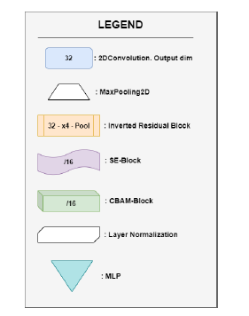
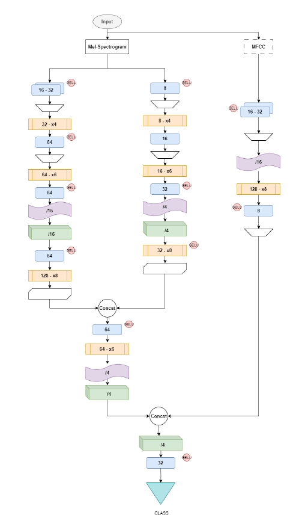
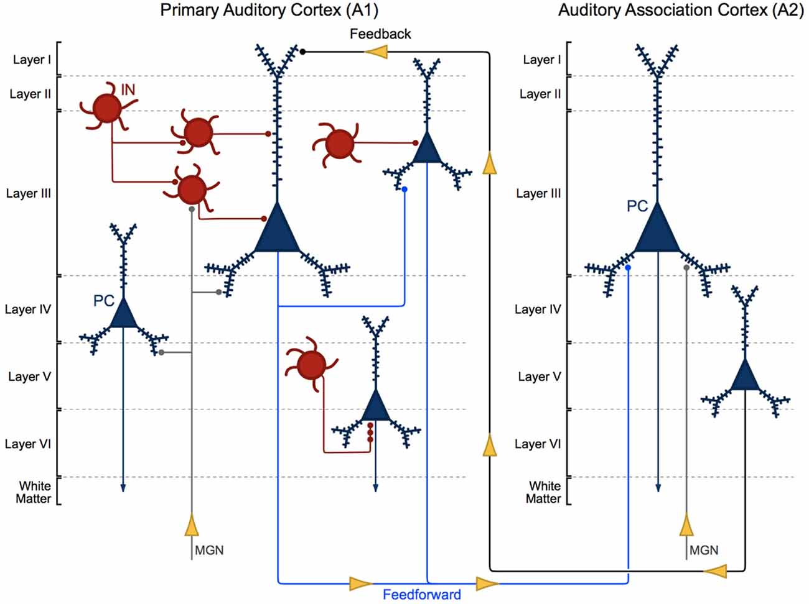

# APAC: Auxiliary Pathway Auditory Cortex (WiP)
## Deep learning model echoing the magic behind the human auditory cortex for fast and accurate speech recogntion

We propose a novel DNN architecture for audio classification, inspired from the intricate structure of the human auditory cortex, named ”APAC”. By emulating the underlying principles of the brain’s auditory processing, our approach aims to enhance the performance and efficiency of audio classification tasks. This study highlights the potential for synergistic insights between neuroscience and machine learning in the pursuit of more effective and biologically-inspired AI systems. We analyze the performance of our model and make a comparison between other classical nets using different spectrogram representation.

## Results summary
